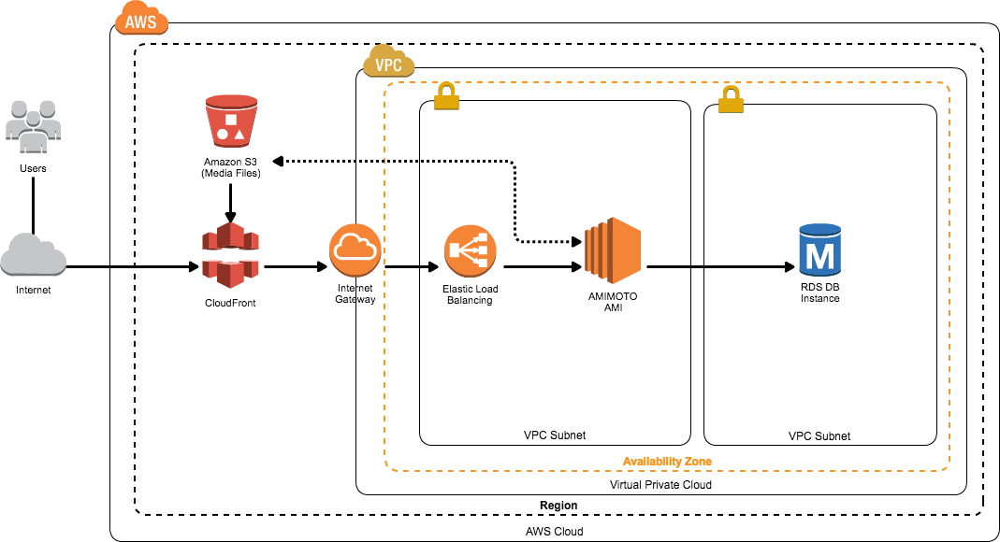
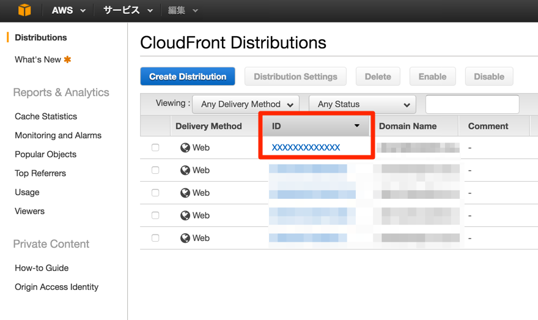

#Preparations
http://bit.ly/1VAnJ8q
- Set up EC2 instance with AMIMOTO AMI
- Set up AWC-CLI on your PC/Mac
- Configure AWC-CLI to conduct CloundFront from command line

# Creating JIN-KEI Simple Stack

Architecture

## All you get are:
- Amazon RDS leads to server fault tolerance;
- CloudFront leads to high-speed contents delivery;
- Amazon S3 leads to a cost reduction for media storage;

## Need some prior arrangement
- Set up EC2 instance with AMIMOTO AMI
- Set up AWC-CLI on your PC/Mac
- Configure AWC-CLI to control CloundFront from command line

### Launch EC2 instance with AMIMOTO AMI
- On this hands-on, we'll migrate databases, so make sure you're working on develop environment.
- WooCommerce Powered by AMIMOTO (Apache HTTPD PHP7) on AWS Marketplace : https://aws.amazon.com/marketplace/pp/B01DAONMCK/
- AMI fee is free for 14 days (AWS infrastructure charges still apply);


Try one instance of this product for 14 days. There will be no hourly software charges for that instance, but AWS infrastructure charges still apply. Free Trials will automatically convert to a paid hourly subscription upon expiration. Note that Free Trials are only applicable for hourly subscriptions, but you can opt to purchase an annual subscription at any time.


### Set up AWS CLI
Two ways to install AWS CLI: 
- Following AWS User guide:
http://docs.aws.amazon.com/cli/latest/userguide/installing.html
- For Mac user install it through package manager Homebrew:
http://brew.sh/index.html

#### Mac: Setting up with Homebrew
Copy below command then paste to Terminal.app
- /usr/bin/ruby -e "$(curl -fsSL https://raw.githubusercontent.com/Homebrew/install/master/install)"
- brew install wget
- brew install awscli

#### Windows: Download installer and use it
- Download the AWS CLI MSI installer for Windows (64-bit):https://s3.amazonaws.com/aws-cli/AWSCLI64.msi
- Download the AWS CLI MSI installer for Windows (32-bit):https://s3.amazonaws.com/aws-cli/AWSCLI32.msi

By default, files are extract into below directory:
- C:\Program Files\Amazon\AWSCLI (64-bit)
- C:\Program Files (x86)\Amazon\AWSCLI (32-bit)

### Set up IAM for AWS CLI
You need credentials to use AWS CLI, so create and get it from AWS console using IAM (AWS Identity and Access Management).

#### Open IAM page on AWS Console
https://console.aws.amazon.com/iam/home#home

#### Create a user
- Click [Users] on left menu;
- Click [Create New Users] to launch wizard;
- Input [awscli] into [Enter User Names], to define the user is for awscli;
- Check [Generate an access key for each user];
- Create it;

#### Save credentials to your PC
Make sure you copied it into your PC, you cannot get them again if you closed the window or tab.
If you lost them create another user and get another credentials.
- Access Key ID
- Secret Access Key

##### Attach policy to IAM user awscli
##### Attach policy to created IAM user
- Click [Users] on the left menu;
- Click [awcli];
- Click [Permissions];
- Click [Attach Policy] in [Managed Policies] area;
- Choose  [CloudFrontFullAccess] then click [Attach Policy];

#### Initial set ups AWS CLI
```
aws configure --profile awscli
```

##### Values
Input below values on verbose: 
- Credentials
- Default Region
- Output formant

```
AWS Access Key ID [None]: xxxxxxxxxx
AWS Secret Access Key [None]: xxxxxxxxxx
Default region name [None]: ap-northeast-1
Default output format [None]: json
```

#### Check settings on AWS CLI
Run below command: 
```
$ aws --profile awscli s3 ls
```
If you get no error messages, settings are successfully completed.

### Some set ups to conduct CloudFront through AWC CLI
Basically, AWC CLI disabled CloudFront control. We'll make enable it.
```
$ aws --profile amimoto  configure set preview.cloudfront true
```

## Add CloudFront to AMIMOTO
Benefits to use CloudFront are
- You can use CDN server on AWS around the world;
- CDN reduces server loads and distribute contents high data transfer speeds
- Server fault tolerance with customisable response error message

### Set up commands
- Replace ORIGIN URL to the server domain name (or Public DNS) of AMIMOTO;
- Replace ORIGIN DOMAIN NAME HERE to your domain name of your site for public; 
note: if you have no domain to set, input same values of ORIGIN URL

```
$ export origin_url='{ORIGIN URL}'; export domain='{ORIGIN DOMAIN NAME HERE}'; aws cloudfront create-distribution --cli-input-json "$(curl -l -s https://raw.githubusercontent.com/amimoto-ami/create-cf-dist-settings/master/source_dist_setting.sh | sh)"
```

### Wait for starting CloudFront
It takes 20-30 minutes to start CloudFront.
Set up S3 and RDS while CloudFront is progress on its starts.


## Add S3 to AMIMOTO
### Benefits to using S3
- Extremely low cost media storages
- S3 has redundancy to improve server fault tolerance
- No limits for number of files or sizes

### Set up S3
- Create IAM user
- Create bucket
- Configure bucket
- Set up WordPress plugin

#### Create IAM user
##### Create IAM user
- Click [IAM] in AWS Console;
- Click [Users] on the left menu;
- Click [Create New Users] to launch wizard;
- Input [s3amimoto] into [Enter User Names], to define the user is for S3;
- Check [Generate an access key for each user];
- Create it;

##### Attach policy to created IAM user
- Click [Users] on the left menu;
- Click [s3amimoto];
- Click [Permissions];
- Click [Attach Policy] in [Managed Policies] area;
- Choose  [AmazonS3FullAccess] then click [Attach Policy];


#### Create bucket
- Click [S3] on AWS Console;
- Click [Create Bucket];
- Enter specify name into [Bucket Name];
note: Bucket name must be unique
- Choose [Region];
- Click [Create] to create bucket;

#### Bucket settings
- Choose bucket name which you created;
- Click [Properties] on the right top of the window;
- Click [Statig Website Hosting]
- Choose [Enable website hosting]
- Enter [index.html] to [Index Document]
- [Save]


## Add RDS to AMIMOTO
Benefits to use RDS are:
- You can use DB server with easy to set up and manage;
- Single click to replicate DB or changing its specifications;
- Various DB engines like MySQL/MariaDB/Amazon Aurora;

### Set up RDS
- Access AWS Console
- Click RDS icon
- Click [Launch DB Instance] on [Instance]
- Choose DB engine (we recommend MariaDB)
- Amazon recommends its Aurora, but a little expensive

### Initial set ups
You can set up on [Specify DB Details] page

#### Values of [Settings] column

| Item | Value |
| :-- | :-- |
| DB Instance Identifier | Name of DB instance |
| Master Username | Root user name of DB |
| Master Password | Root password of root user |
| Confirm Passoword | Confirm root password |
Above are required values to connect the DB, save them as text file.
You don't need to change other items, on this hands-on.

#### Set DB name on [Configure Advanced Settings]
Copy the value in [Database Name] which will be  sated as DataBase name.

##### Sample command to connect RDS
```
$ mysql -u {Master Username} -p {Master Password} {Database Name}
```
$ mysql -h {endpoint} -u {Master Username} -p {Master Password} {Database Name}

#### Create RDS
It takes a little time, wanna drink some cup of coffee?

When you click [Instance], you'll find  [DB Instance] same name as [DB Instance Identifier] .
Check the status column. If it is displayed as [Availalble], you succeeded RDS creation.

#### Configure Security Group 
- Let's configure security group
- Click [Edit Security Group]
- Click [Inbound] tab
- Click [Add Rule]
- Set [Type] as [MySQL/Aurora]
- Choose [Anywhere] in [Source]
note: you can set AMIMOTO AMI's IP Address (xxx.xxxx.xxx.xxx/0) to [Source].
- Click [Save]


### Connect RDS as AMIMOTO's DB
#### SSH to AMIMOTO instance
Connect to your AMIMOTO instance through SSH
```
$ ssh -i /path/to/pem/{PEMFILENAME}.pem ec2-user@{INSTANCE_IP}
```

#### Edit wp-config.php
```
$ cd /var/www/vhosts/{INSTANCE_ID}
$ vim wp-config.php
```

#### Where you should edit:
wp-config.php (Line: 26-33)
```
if ( !$db_data ) {
    $db_data = array(
        'database' => '{Database Name}',
        'username' => '{Master Username}',
        'password' => '{Master Password}',
        'host'     => '{RDS_ENDPOINT}',
    );
}
```
##### If you're Vim user: 

| Command | mode |
| :-- | :--|
| [esc] | enter nomal mode|
| :set number | show line numbers |
| [shift]+[z][z] | save and exit |
| i | enter edit mode |

#### Check RDS connections
If you don't see [Error Establishing a Database Connection] when you access your AMIMOTO site with browser, settings and connections are correct.

#### Stop MySQL in EC2
```
$ vim /opt/local/amimoto.json
```
Add ["mysql": { "enabled": false },] line.
Don't forget add comma(,) in the end of line.
##### Before
```
{
  "mod_php7" : { "enabled": true },
  "run_list" : [ "recipe[amimoto]" ]
}
```

######After
```
{
  "mod_php7" : { "enabled": true },
  "mysql": { "enabled": false },
  "run_list" : [ "recipe[amimoto]" ]
}
```

##### Run Command
```
$ sudo /opt/local/provision
$ sudo service mysql stop
```

#### Install plugin to WordPress
- Login to WordPress' Dashboard;
- Enable Nephila Clavata pluign on the plugin page;
- Fill in S3 settings to [Nephila Clavata] on [Setting];

| Item Name | Value |
| :-- | :--|
| AWS Access Key | AWS Access key of your s3amimoto |
| AWS Secret Key | s3amimotoのAWS Secret Key |
| AWS Region | Choose specify region which you created S3 bucket on |
| S3 Bucket | Name of S3 bucket which you created |
| S3 URL | [Endpoint] of S3 Bucket |
| Storage Class | STANDARD |

## Last settings for CloudFront
Set up some utilities for CloudFront on WordPress

### Work flows
- Create IAM user
- Set up plugin for WordPress

#### Create IAM user
##### Create IAM user
- Click [IAM] in AWS Console;
- Click [Users] on the left menu;
- Click [Create New Users] to launch wizard;
- Input [cfamimoto] into [Enter User Names], to define the user is for CloudFront;
- Check [Generate an access key for each user];
- Create it;

##### Attach policies to IAM user
Attach policy to created IAM user
- Click [Users] on the left menu;
- Click [cfamimoto];
- Click [Permissions];
- Click [Attach Policy] in [Managed Policies] area;
- Choose  [CloudFrontFullAccess] then click [Atattch Policy];

#### Set up plugin for WordPress
##### Set up Cache flush plugin: C3 CloudFront Clear Cache
- Login to the Dashboard;
- Enable [C3 CloudFront Clear Cache] on plugin page;
- Fill in some value on [C3 Settings] on [Setting] menu;


| Item Name | Value |
| :-- | :-- |
| CloudFront Distribution ID | input your CloudFront Distribution ID |
| AWS Access Key | AWS Access Key of cfamimoto |
| AWS Secret Key | AWS Secret Key of cfamimoto|

##### How to check CloudFront Distribution ID


##### Plugin for apply changes on preview 
```
$ cd /var/www/vhost/{INSTANCE_ID}/wp-content
$ sudo mkdir mu-plugins && cd mu-plugins
$ sudo wget https://gist.githubusercontent.com/wokamoto/ecfd3a7ea9ef80ea1628/raw/02e4e011597c0969f0ff4dec48de539a89b96e4a/cloudfront-preview-fix.php
$ sudo chown nginx:nginx cloudfront-preview-fix.php
```
